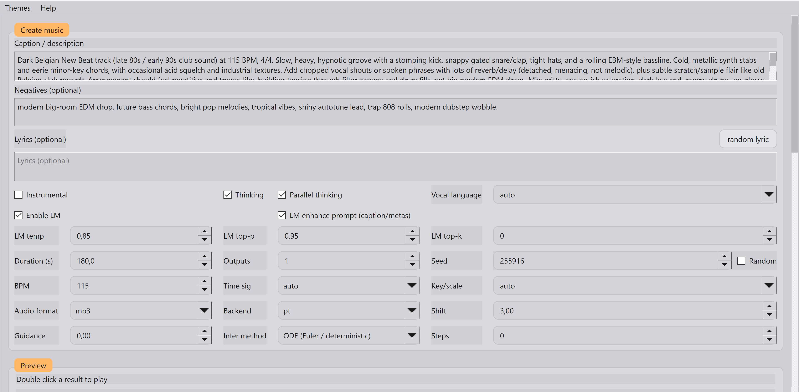
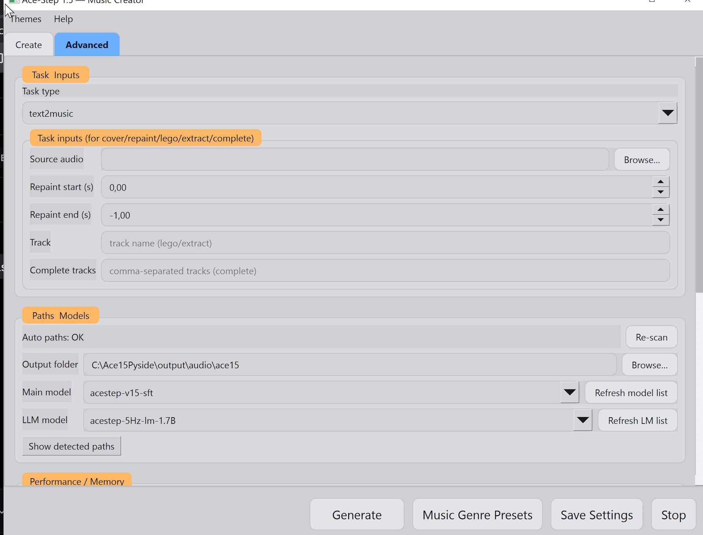
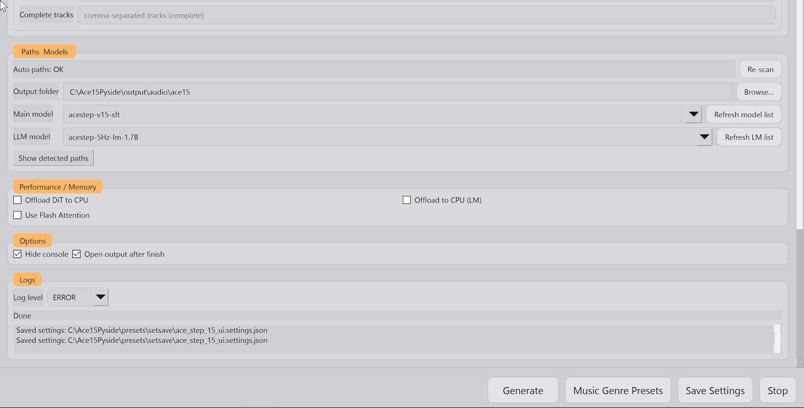

# 🎛️ Ace-Step 1.5 Pyside6 ui

---

| 🔎 Quick links | |
|---|---|
| 🧩 Install notes | [Jump](#-install-notes) |
| ✨ Features | [Jump](#-features-) |
| 🚫 Not working | [Jump](#-not-workingnot-installed) |
| 🛠️ Todo | [Jump](#-todo-) |

All credits to & original model here : https://github.com/ace-step/ACE-Step-1.5
---

## 🧩 Install notes :
(python and Git should be installed on your system, installer is created mostly for Cuda / RTX)
- unzip to C drive, double click 'install.bat', give one time permission (windows) to run unknown bat file.
- It will create environment and install dependencies, download repo and turbo model + 1.7B LM
- when finished double click 'run.bat' (give one time permission (windows) to run unknown bat file.)
- First time use of other models/LM will download them, expect slow results at first time use.

---

## ✨ Features :
- Tooltips, 'auto', 'let Ace decide' and other helpful defaults for easy first time use.
- Wheelguard on/off (allow changes while scrolling on/off)
- 'Fancy banner' on/off
- 25 themes (imported from my Framevision app, not all Themes look good or make a lot of change in this standalone version)
- Genre preset manager (add/edit/delete,..) comes with 60+ example presets, all presets are saved with thinking on + SFT model + 1.7B Lm for best results, this takes a lot longer and may require extra vram, use an editor such as notepad++ to replace all models in the .json file at once with a lower (turbo and 0.6B) model/Lm when needed. 
How to add a preset ? It wll first ask for the main genre (eg 'Rock', next it asks for the subgenre (eg. 'metal') If you it already exists it will be overwritten.
- Mostly build around the text to music feature, all (most) main settings and toggles available.
  All other features such as cover, repaint,.. are also available in the 'advanced settings' (but mostly untested)
- Auto checks for repo, environment and models, cli,... at startup, if you already have all models downloaded, you can simply copy them and re use them (models\ace_step_15\repo\ACE-Step-1.5\checkpoints)
- Last results (double click to play)
- Random seed toggle (shows seed used instead of -1)
- Auto rename results (genre - seed - date . mp3)
- Offload options (needs testing on -16 gig vram cards)
- logger
- Online updater
- Queue for unlimited generations with cancel running / remove from queue, still keeps selection 1-4 (or 8 with some models) as 1 job. Queue has mmemory to continue after restart app

---

## 🚫 Not working/not installed
- Flash
- nano-vllm (fallback to Pytorch)
- tell me what else is not working.

---

## 🛠️ Todo :
- try to fix flash & nano-vllm when i find the time
- Add more functions /updates

---

## Screenshots (Signal Grey theme)

| Screenshot 1                          | Screenshot 2                        | Screenshot 3                         | Preset Manager                             |
|----------------------------------------|----------------------------------------|----------------------------------------|----------------------------------------|
|  |  |  |  |
